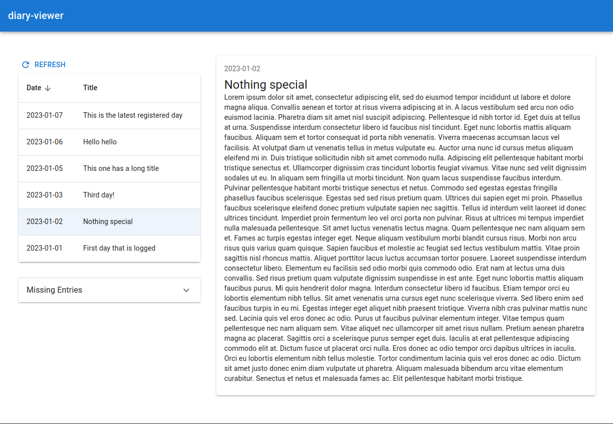

# diary-viewer

> **Warning**
> This is a dirty experimental learning playground. Not intended to be more.

A diary is a directory that contains text files `YYYY-MM-DD Some title.txt` corresponding to daily entries.

A web server (in `backend`) written in Haskell using `servant` provides a REST API to interact with the diary (located in `backend/diary`) along with a web socket endpoint to signal about live changes in the directory.

A frontend (in `frontend`) provides a React + Material UI user interface. It is served with Vite.

# Setup

1. Have `nix` with flakes enabled (if not, install the dependencies mentionned in `flake.nix` manually and skip step 2)
2. Enter the dev shell with `nix develop`
3. In `backend`
    * Generate the cabal file with `hpack`
    * Run the API server with `cabal run`
4. In `frontend`
    * Run the Vite server with `yarn dev`
